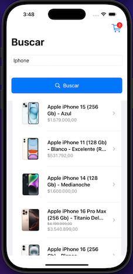
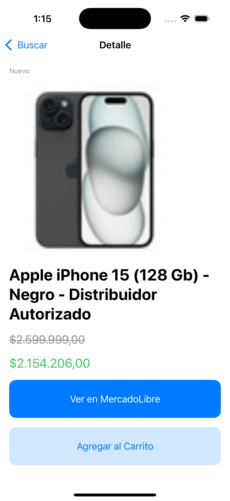
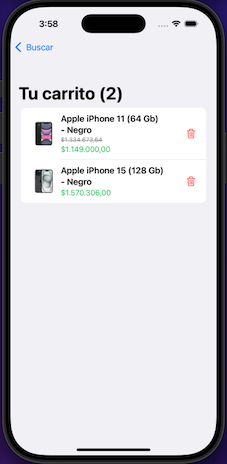
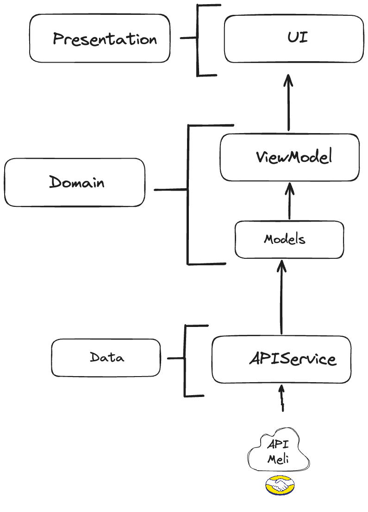

# MeliSearch

Aplicación iOS desarrollada en SwiftUI que permite buscar productos en la API de MercadoLibre, ver sus detalles y agregarlos a un carrito de compras.
Utilizando MVVM como arquitectura.


## 📌 Características
- Búsqueda de productos utilizando la API de MercadoLibre.
- Vista de detalles del producto con imagen, precio y enlace a MercadoLibre.
- Funcionalidad de agregar productos al carrito de compras.
- Visualización de los productos en el carrito y opción para eliminarlos.
- Soporte para Pull-to-Refresh en la lista de productos.
- Manejo de errores y estado de carga.

## 📷 Capturas de Pantalla




## 📚 Arquitectura


## 🗂️ Estructura ficheros
```bash
MeliSearch/
├── Models
├   ├── Product
├── Networking
├── ViewModels
├── Views
── MeliSearchApp
├── MeliSearchTests
├── MeliSearchUITests
```

## 🚀 Instalación

### **1. Clonar el repositorio**
```bash
https://github.com/Sebastian-Beltran/MeliSearch.git
```

### **2. Abrir el proyecto en Xcode**
```bash
xed .
```
O abre manualmente el archivo `MeliSearch.xcodeproj` en Xcode.

### **3. Instalar dependencias (si aplica)**
Este proyecto no utiliza librerías externas. Si decides agregar alguna, usa Swift Package Manager.

### **4. Ejecutar la aplicación**
1. Asegúrate de seleccionar un simulador (`iPhone 15 Pro` recomendado).
2. Presiona `Cmd + R` para compilar y ejecutar.

## 🛠️ Configuración Adicional
### **Habilitar carga de imágenes HTTP**
Si las imágenes no se cargan, asegúrate de haber agregado esta configuración en `Info.plist`:

```xml
<key>App Transport Security Settings</key>
<dict>
    <key>Allow Arbitrary Loads</key>
    <true/>
</dict>
```


## ✅ Pruebas Unitarias
Para ejecutar las pruebas:
```bash
Cmd + U
```
Las pruebas se encuentran en la carpeta `MeliSearchTests/` y `MeliSearchUITests/`.
